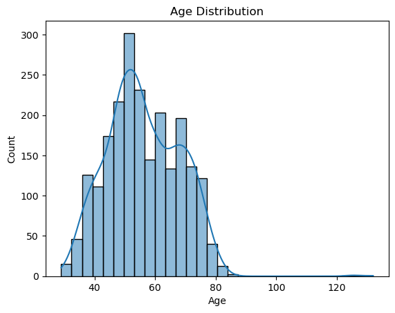
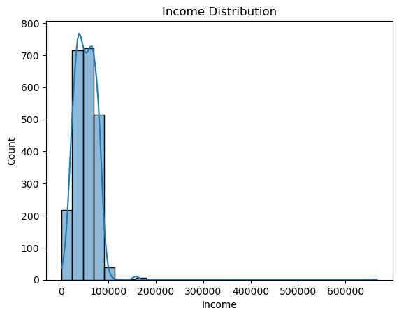
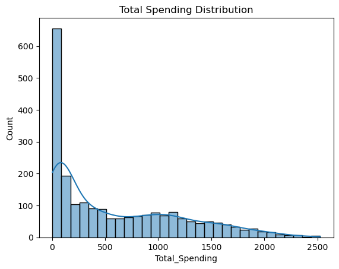
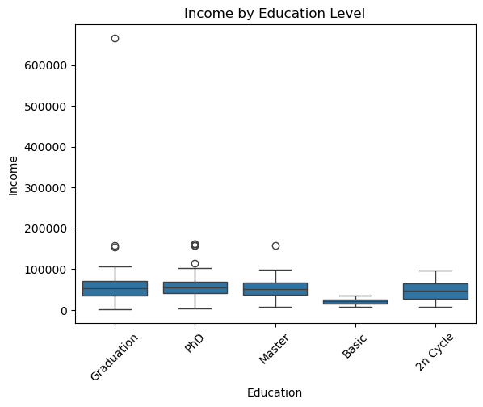
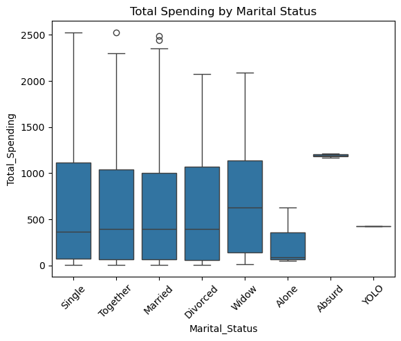
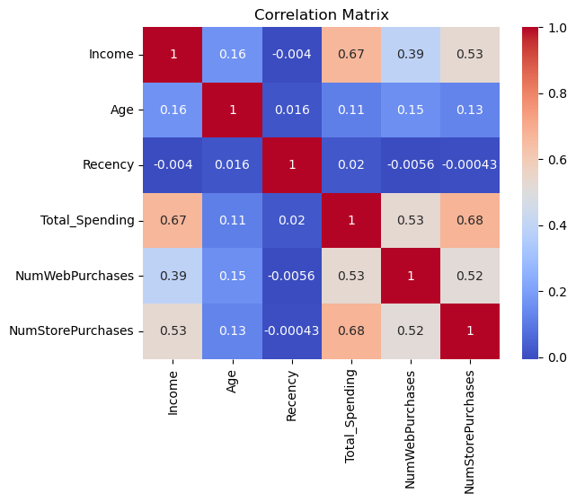
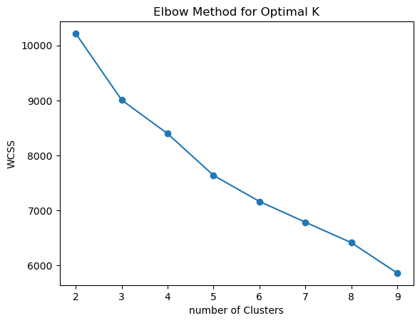
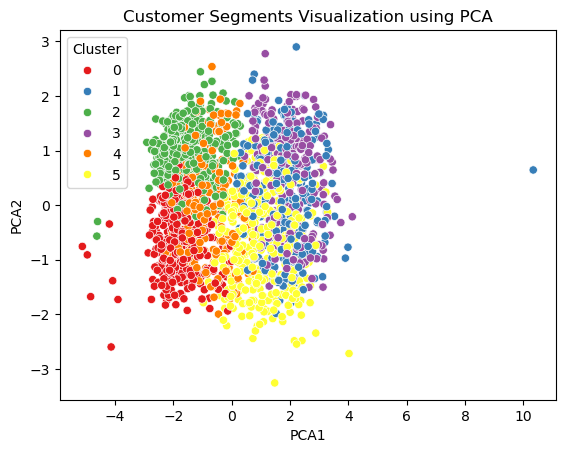
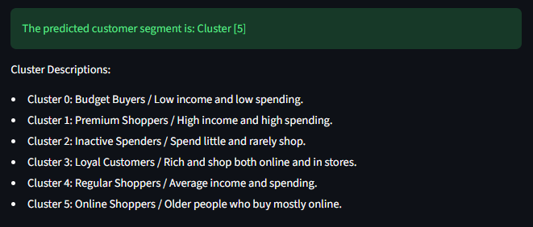

# 🧩 Customer Segmentation using Machine Learning  

This project identifies different customer groups based on their age, income, spending habits, and shopping behavior. Using **K-Means Clustering**, it helps businesses understand their customers better and make smarter marketing decisions.  

**Dataset Source:** [Customer Segmentation – Kaggle](https://www.kaggle.com/datasets/vishakhdapat/customer-segmentation-clustering)

---

## 📖 Overview  

The goal of this project is to divide customers into meaningful segments so that a company can:  
- Identify high-value customers.  
- Personalize marketing strategies.  
- Improve customer retention and engagement.  

After analyzing customer behavior and demographics, the data was processed, visualized, and grouped into **six distinct clusters** based on their similarities.

---

## 📊 Data Analysis Summary  

### 🧓 Age Distribution  
Most customers fall between **30 to 60 years**, showing that the company’s products mainly attract middle-aged adults.  

### 💰 Income Distribution  
Income levels vary widely, but the majority earn between **30,000 – 80,000**, giving a broad target range for marketing.  

### 🛒 Total Spending  
Spending patterns reveal a few high-value customers who contribute to a large portion of total sales, while many customers spend moderately.  

### 🎓 Education & Income  
Higher education levels generally correspond to higher income, showing a direct relationship between education and purchasing power.  

### 💑 Marital Status & Spending  
Married customers tend to spend more on average, likely due to household purchases.  

### 🔥 Correlation Insights  
Income and spending show a strong positive correlation — higher earners tend to spend more.  

---

## 🧮 Clustering Summary  

The **Elbow Method** suggested that 6 clusters provide the best balance between accuracy and simplicity.  

Each customer cluster represents a unique segment of the company’s audience.

| Cluster | Age | Income | Total Spending | Web Purchases | Store Purchases | Web Visits | Recency |
|----------|-----|---------|----------------|----------------|------------------|-------------|----------|
| 0 | 47.7 | 31,559 | 103.9 | 2.1 | 3.1 | 6.8 | 27 |
| 1 | 46.2 | 78,271 | 1305.9 | 4.6 | 8.6 | 2.6 | 49 |
| 2 | 51.8 | 35,114 | 132.8 | 2.4 | 3.4 | 6.5 | 79 |
| 3 | 69.4 | 73,559 | 1200.6 | 4.7 | 8.5 | 2.7 | 52 |
| 4 | 68.7 | 43,788 | 173.7 | 2.6 | 4.0 | 5.5 | 38 |
| 5 | 58.8 | 59,830 | 889.3 | 7.9 | 7.9 | 6.4 | 46 |

---

## 🧠 Customer Segment Descriptions  

| Cluster | Label | Description |
|----------|--------|-------------|
| **0** | 🧾 Budget Buyers | Low income and low spending — value-conscious customers. |
| **1** | 💎 Premium Shoppers | High income, high spending — best customers for premium offers. |
| **2** | 💤 Inactive Spenders | Low spending and long inactivity — may need re-engagement. |
| **3** | ❤️ Loyal Customers | Wealthy, loyal shoppers — shop both online and offline frequently. |
| **4** | 👪 Regular Shoppers | Middle-income, average spending — stable customer base. |
| **5** | 🌐 Online Shoppers | Older customers who prefer online purchases. |

---
## 🌐 Streamlit Application  

A **Streamlit web app** is created to predict which customer segment a new user belongs to.  
You can input customer details such as age, income, spending, and online activity, and the model will instantly show their segment.

